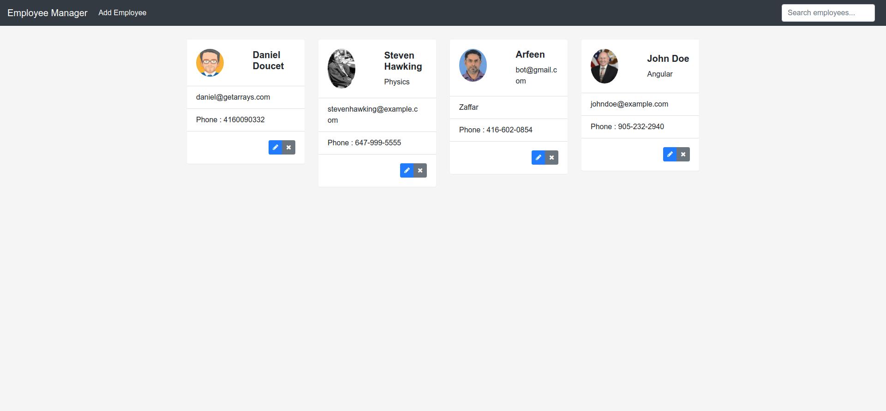

# Employee Manager App

Full stack Employee Manager Application created using Angular for the frontend UI, Spring Boot for the RESTful API, and MySQL for the database.

To see the code for the API, visit: https://github.com/SaadMukhtar/EmployeeManager-RESTfulAPI

## Features
- Get / Search Employee Info Card
- Create Employee Info Card
- Update Employee Info Card
- Delete Employee Info Card